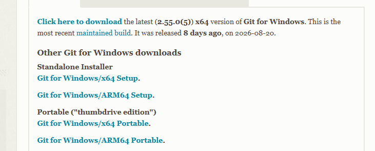

# Plantilla del Curso de Programación Web 

2026-2

---

## Descripción del Proyecto

Esta plantilla implementa una aplicación web full-stack utilizando React.js + Vite para el frontend y Node.js + Express para el backend. El proyecto está organizado para separar la interfaz, lógica de negocio, acceso a datos y configuración, permitiendo desarrollar tanto el sitio web como un panel administrativo.

La aplicación utiliza Supabase como base de datos y dispone de migraciones SQL para gestionar su estructura y datos iniciales. Además, incluye configuración para Vercel, vistas EJS para páginas del servidor y una API organizada mediante controladores, servicios y repositorios.

| Carpeta | Descripción |
|---|---|
| `admin/` | Lógica del panel administrativo: APIs, controladores, modelos, repositorios y servicios. |
| `api/` | Punto de entrada de la API del servidor. |
| `configs/` | Configuración general, base de datos, middlewares y funciones auxiliares. |
| `db/` | Esquema y migraciones SQL de la base de datos Supabase. |
| `docs/` | Documentación técnica, incluyendo el diagrama de la base de datos. |
| `public/` | Archivos públicos y recursos estáticos. |
| `src/` | Aplicación React: páginas, componentes, estilos, helpers y entradas de la aplicación. |
| `views/` | Plantillas EJS para las páginas renderizadas por Express. |
| `website/` | Lógica del sitio web: APIs, controladores, modelos, repositorios, rutas y servicios. |
| `server.js` | Archivo principal para iniciar y configurar el servidor Express. |

---

# 🚀 Comandos GIT

Descargar enlace [enlace](https://git-scm.com/install/windows)


## 📁 Crear proyecto GIT

Inicializa un nuevo repositorio Git:
    
```bash
git init
```

# Git - Comandos más usados

- `git init` — Crear repositorio
- `git clone <url>` — Clonar repositorio
- `git status` — Ver estado
- `git add .` — Agregar cambios
- `git commit -m "mensaje"` — Crear commit
- `git push` — Subir cambios
- `git pull` — Descargar cambios
- `git fetch` — Descargar cambios sin fusionar
- `git branch` — Ver ramas
- `git switch <rama>` — Cambiar de rama
- `git switch -c <rama>` — Crear y cambiar de rama
- `git merge <rama>` — Fusionar ramas
- `git log --oneline` — Ver historial
- `git diff` — Ver diferencias
- `git stash` — Guardar cambios temporalmente
- `git stash pop` — Recuperar cambios
- `git restore <archivo>` — Deshacer cambios
- `git revert <commit>` — Revertir un commit
- `git reset --hard <commit>` — Volver a un commit
- `git remote -v` — Ver repositorios remotos


Instalar dependencias:

    npm install
    npm install -g vercel
    vercel login
    vercel --prod
    